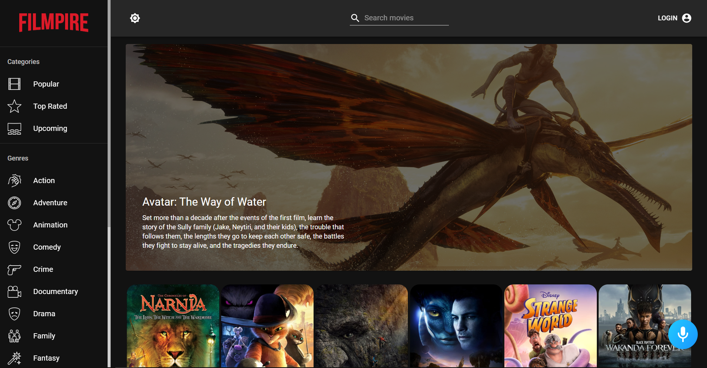

# MovieMania

## Introduction

- MovieMania is an online database of information related to movies. Users can search for movies and learn about movies, as well as the cast of the movie. Navigating through the application is made simple. Filmpire also provides ratings of movies.

- MovieMania
 combines the desire to unleash powerful creativity with the industry's most advanced JavaScript tools including React.js, Redux, Material UI, and more.

- This application includes user authentication, dark mode, sort movie on the basis of categories or genres, viewing movie and actor details, adding a movie to favorites or watchlist and many more functionalities.

## Screenshots
### Light Mode

### Dark Mode

